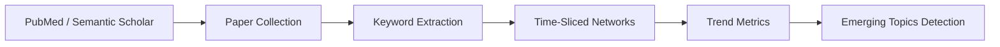

# Paper Trend Tracking

[](https://opensource.org/licenses/MIT)

Track and predict research trends by analyzing keyword network evolution over time.

**Repository:** [github.com/hiuhiu2026/paper-trend-tracking](https://github.com/hiuhiu2026/paper-trend-tracking)

## Core Idea



## Features

✅ **Data Collection**
- PubMed E-utilities API (biomedical literature)
- arXiv API (preprints - CS, Physics, Math, Quantitative Biology)
- bioRxiv API (biology preprints - genetics, neuroscience, cancer, etc.)
- Semantic Scholar (optional, requires API key)
- Unified collector with cross-source deduplication

✅ **Keyword Extraction** (swappable)
- **YAKE** (default) - Fast, unsupervised
- **TF-IDF** - Corpus-based statistics
- **LLM** - High quality (OpenAI/Anthropic)
- **MeSH** - PubMed medical subject headings
- **Hybrid** - Combine multiple methods

✅ **Network Analysis**
- Time-sliced keyword co-occurrence networks
- Centrality metrics: degree, betweenness, PageRank
- Trend detection via metric evolution
- Emerging cluster detection

✅ **Visualization**
- Interactive network graphs
- Trend evolution charts
- Plotly Dash dashboard

## Quick Start

### Installation (Conda - Recommended)

```bash
cd paper-trend-tracking

# 1. Create conda environment
conda env create -f environment.yml

# 2. Activate environment
conda activate paper-trends

# 3. Download spaCy model
python -m spacy download en_core_web_sm
```

### Installation (Pip)

```bash
cd paper-trend-tracking

# 1. Create virtual environment
python -m venv venv
source venv/bin/activate  # On Windows: venv\Scripts\activate

# 2. Install dependencies
pip install -r requirements.txt

# 3. Download spaCy model
python -m spacy download en_core_web_sm
```

### Run the Pipeline

```bash
# Configure (optional - works without API keys)
cp config.example.yaml config.yaml

# Run pipeline
python run_pipeline.py

# View results
# - Database: data/papers.db
# - Visualizations: output/visualizations/
# - Logs: logs/pipeline.log
```

See [INSTALL.md](INSTALL.md) for detailed installation instructions.

## Project Structure

```
paper-trend-tracking/
├── src/
│   ├── data_collector.py    # API clients (PubMed, Semantic Scholar)
│   ├── database.py          # SQLAlchemy models & DB manager
│   ├── keyword_extractor.py # Swappable extraction methods
│   ├── network_builder.py   # Network construction & trend analysis
│   ├── pipeline.py          # Main orchestration
│   └── visualization.py     # Plotly graphs & Dash dashboard
├── data/                    # Database & data files
├── output/
│   └── visualizations/      # Generated charts
├── logs/                    # Log files
├── config.example.yaml      # Configuration template
├── run_collector.py         # Standalone collection script
├── run_pipeline.py          # Full pipeline runner
├── test_keyword_extraction.py
└── requirements.txt
```

## Configuration

Edit `config.yaml`:

```yaml
# API Keys (optional)
api_keys:
  pubmed: "your_ncbi_api_key"      # Increases limit from 3 to 10 req/sec
  semantic_scholar: "your_s2_key"   # For higher tier access

# What to track
collection:
  tracked_queries:
    - "machine learning drug discovery"
    - "deep learning protein structure"
    - "AI clinical trials"
  from_date: "2024-01-01"
  max_papers_per_query: 500

# Keyword extraction
keywords:
  method: "yake"  # Options: yake, tfidf, llm, mesh, hybrid
  yake:
    max_ngram_size: 3
    num_keywords: 10

# Network settings
network:
  time_window: "month"  # week, month, quarter
  min_cooccurrence: 2   # Min co-occurrences for edge
```

## Usage Examples

### Run Full Pipeline

```bash
python run_pipeline.py
```

### Run Collection Only

```bash
python run_collector.py
```

### Programmatic Usage

```python
from src.pipeline import PaperTrendPipeline

# Load from config
pipeline = PaperTrendPipeline.from_config('config.yaml')

# Run collection
papers = pipeline.run_collection(
    queries=["your research topic"],
    max_per_query=200,
    from_date="2024-01-01"
)

# Build networks
snapshots = pipeline.run_network_analysis(
    time_window='month'
)

# Get trends
trends = pipeline.get_trends(limit=50)
for kw in trends[:10]:
    print(f"{kw['keyword']}: growth={kw['growth_rate']:.2f}")

# Get emerging clusters
clusters = pipeline.get_emerging_clusters()
```

### Run Interactive Dashboard

```bash
# Start dashboard server
python -c "from src.visualization import TrendDashboard; TrendDashboard().create_dashboard(port=8050)"

# Open in browser: http://localhost:8050
```

**Dashboard Features:**
- 📈 Real-time trend charts with multiple metrics
- 🕸️ Interactive keyword network visualization
- 📋 Exportable data table
- ⏱️ Filter by time window (day/week/month/quarter)
- 🎛️ Adjustable top-N slider

### Generate Static Visualizations

```bash
python -c "from src.visualization import create_visualizations; create_visualizations()"
```

## Output

### Database Schema

- **papers**: Paper metadata (title, abstract, authors, journal, DOI)
- **keywords**: Extracted keywords with statistics
- **paper_keywords**: Many-to-many relationship
- **keyword_network_snapshots**: Time-sliced network data
- **trend_metrics**: Computed trend metrics per keyword per snapshot

### Trend Metrics

| Metric | Description |
|--------|-------------|
| `growth_rate` | Change in occurrences vs previous period |
| `momentum` | Acceleration of growth (2nd derivative) |
| `degree` | Number of co-occurring keywords |
| `betweenness` | Bridge between keyword clusters |
| `pagerank` | Overall importance in network |

## API Rate Limits

| Source | Rate Limit | API Key Required | Content |
|--------|-----------|------------------|---------|
| PubMed | 3-10 req/sec | Optional | Biomedical literature |
| arXiv | ~6 req/sec | No | CS, Physics, Math, Quant Bio |
| bioRxiv | ~2 req/sec | No | Biology preprints |
| Semantic Scholar | 100 req/sec | Yes (free) | All fields |

**Default configuration: PubMed + arXiv + bioRxiv (no API keys required)**

Get API keys (optional):
- **PubMed**: https://www.ncbi.nlm.nih.gov/account/ (increases limit to 10 req/sec)
- **Semantic Scholar**: https://www.semanticscholar.org/product/api (required for access)

### Configure API Keys

Edit `config.yaml`:

```yaml
api_keys:
  pubmed: "your_ncbi_api_key"
  semantic_scholar: "your_s2_api_key"
```

## Next Steps

- [ ] Add scheduled collection (cron jobs)
- [ ] Implement keyword synonym resolution
- [ ] Add more data sources (arXiv, bioRxiv)
- [ ] Improve trend prediction (ML models)
- [ ] Export reports (PDF/Markdown)

## License

MIT
